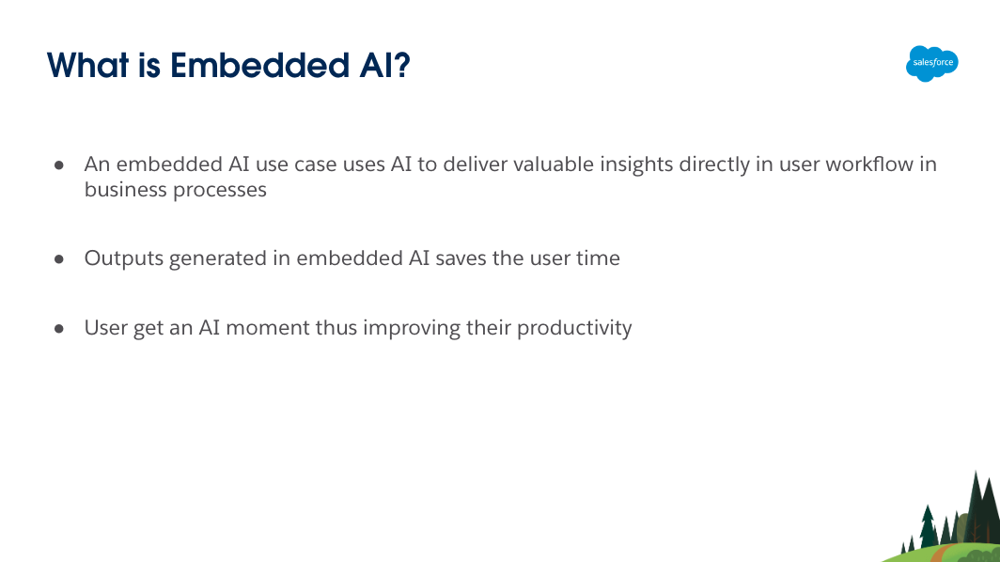
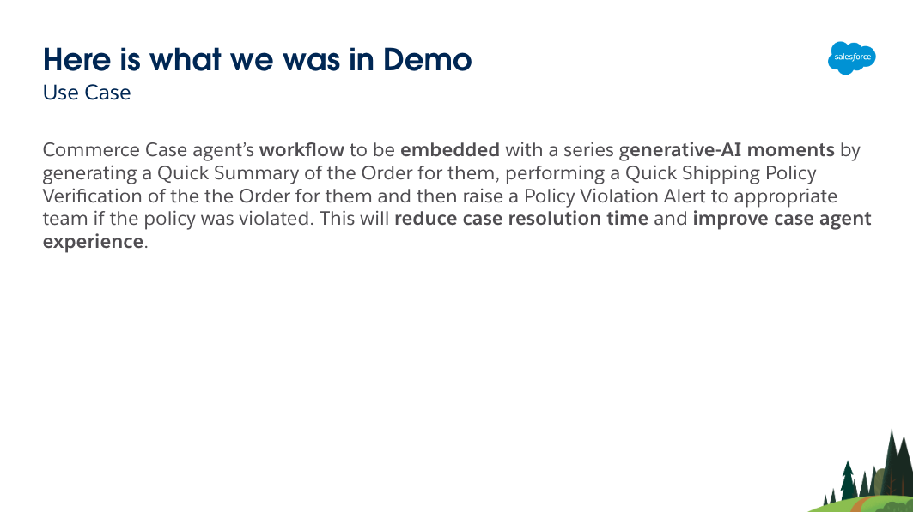
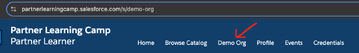
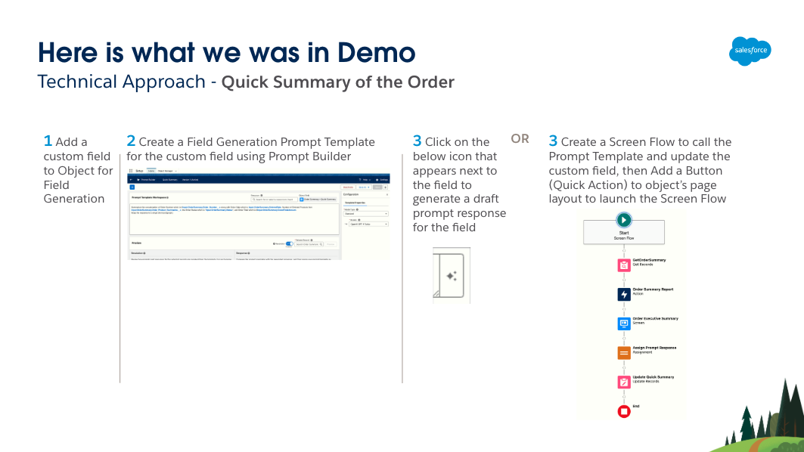
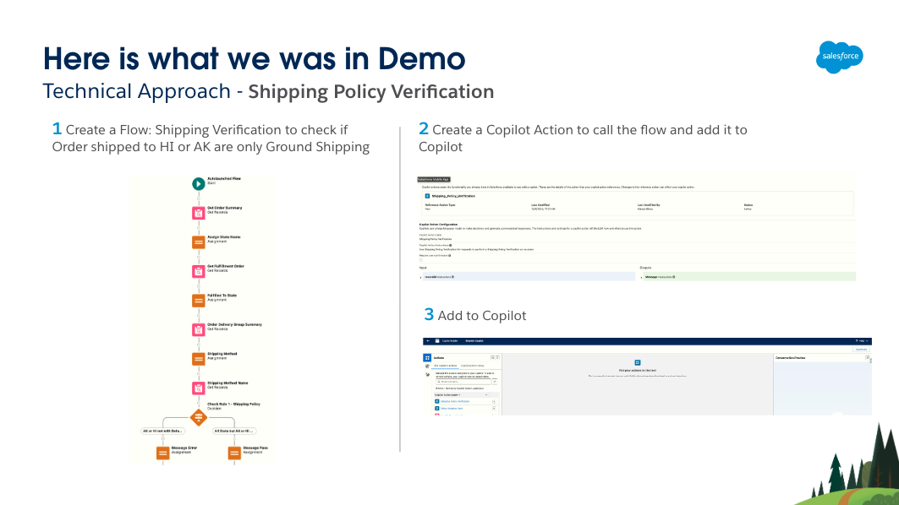
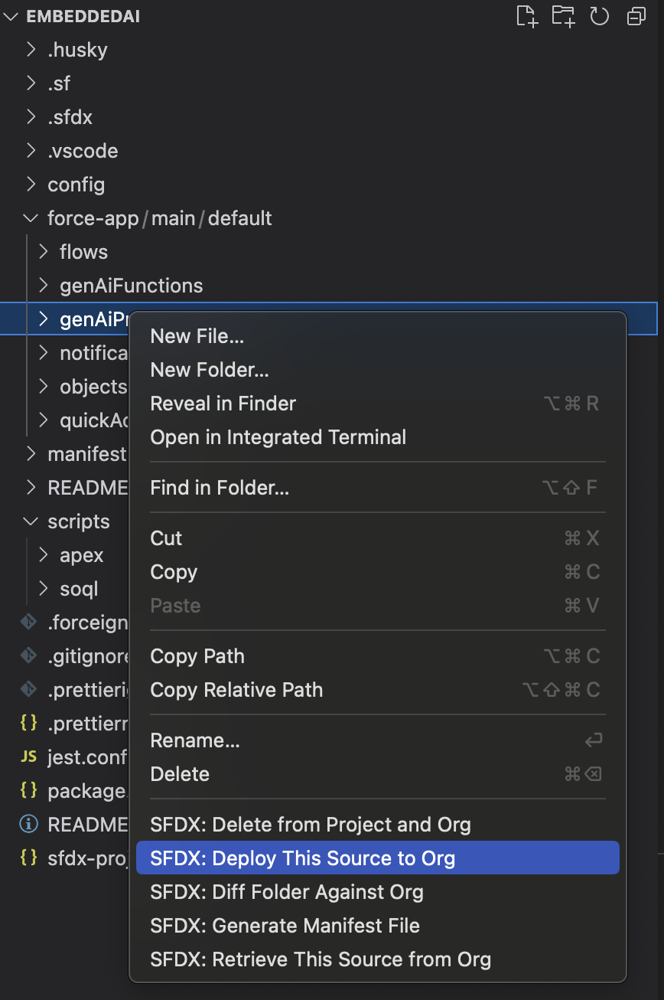
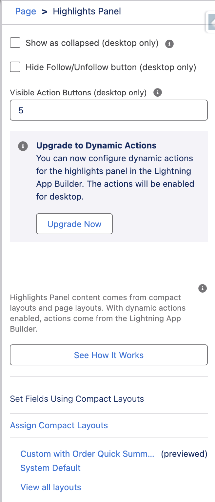
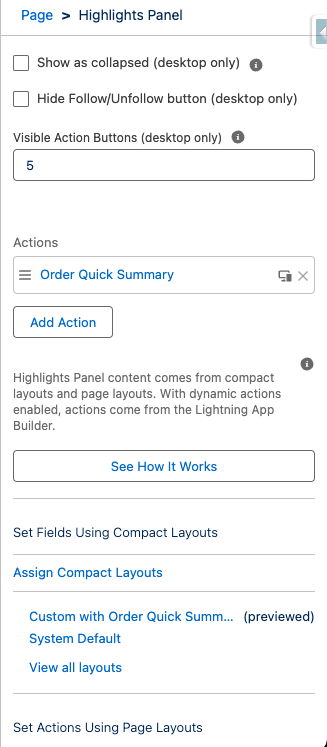

# Embedded AI Use Case

# Prerequisites

1. Visit [Partner Community for AI & Einstein Partners](https://partners.salesforce.com/_ui/core/chatter/groups/GroupProfilePage?g=0F94V000000g5m5&fromEmail=1) to obtain the AI|SDO Pocket Guide from information section on left
    - Get a [Demo Org (SDO) for Partners](https://salesforce.quip.com/4m1gAiNB4O5I#temp:C:abXe66becdc9c4e44baa4491c352)
        - 

2. Enable [Prompt Builder](https://salesforce.quip.com/4m1gAiNB4O5I#temp:C:abX97591d0fb3b148398bb4dd599) and [Einstein Copilot](https://salesforce.quip.com/4m1gAiNB4O5I#temp:C:abX02f483812795425d8563c8d24)

3. Get ready with [Salesforce DX](https://trailhead.salesforce.com/content/learn/projects/quick-start-salesforce-dx)
    - Install [Salesforce CLI](https://developer.salesforce.com/docs/atlas.en-us.sfdx_setup.meta/sfdx_setup/sfdx_setup_install_cli.htm)
    - Install [Visual Studio Code](https://code.visualstudio.com/download)
    - Install [Git](https://git-scm.com/downloads)
    - Install [Salesforce Extension for Visual Studio Code](https://developer.salesforce.com/docs/platform/sfvscode-extensions/guide)

# Solution Overview

- [Watch the demo of the Solution](https://salesforce.vidyard.com/watch/h9n8v29iAvH6mXp1C85RK4?)

- Solution Technical Approach
   -  
   -  
   -  

# Installation instructions

1. Clone the [Repo](https://github.com/mbsf2022/EmbeddedAI.git) to get the metadata for the solution of the use case
    - git clone https://github.com/mbsf2022/EmbeddedAI.git
2. In Visual Studio Code, OPEN the folder EnbeddedAI
3. In Visual Studio Code, AUTHENTICATE to SDO Org
    - Open Command Palette or press Ctrl + Shift + P, then Select “SFDX: Authorize an Org“ and finally select Project Default and Allow Access
    - Alternatively, [Authorize SDO Org Using a Browser](https://developer.salesforce.com/docs/atlas.en-us.sfdx_dev.meta/sfdx_dev/sfdx_dev_auth_web_flow.htm)
4. In Visual Studio Code, DEPLOY the below metadata to SDO Org by right-click on force-app folder and select SFDX: Deploy This Source to Org 
    - flows
    - genAiFunctions
    - genAiPromptTemplates
    - notificationtypes
    - objects
    - quickActions

        - 
    - Note: If you experience deployment errors related to "genAiFunctions" then use [this](https://login.salesforce.com/packaging/installPackage.apexp?p0=04tao000000myt7) unmanaged package to deploy it. Deploy the rest of the metadata listed in the above bullet points using the right-click approach described above on each individual folder, rather than right-clicking on the force-app folder. Make sure to remove two flows (Shipping Policy Verification and Policy Violation Alert) from SDO Org in case you already deployed them in this step since they are already in the unmanaged package
5. For the Order Summary object, make the Custom with Order Quick Summary as the default Compact Layout
    - Setup -> Object Manager -> Order Summary object -> Compact Layouts -> Compact Layout Assignment -> Edit -> Select Custom with Order Quick Summary
6. On Order Summary Record page, add Action - Order Quick Summary
    - App Launcher -> Order Management -> Order Summaries -> Select an Order -> Setup - Edit Page -> Select Highlight Panel on top -> Add Action - Order Quick Summary (Note: Upgrade to Dynamic Actions if not already selecting to Migrate and for SDO OMS Order Summary)
        - From:
            - 
        - To:
            - 
7. Assign Copilot Actions to Copilot and Activate Copilot
    - Setup -> Einstein Copilots -> Select Einstein Copilot -> Open in Builder -> Deactivate Copilot -> In Copilot Action Library and Select and Assign to Copilot

# Usage instructions

- [Don't forget to watch the demo](https://salesforce.vidyard.com/watch/h9n8v29iAvH6mXp1C85RK4?)

## Additional Resources

- [Einstein Copilot Documentation](https://help.salesforce.com/s/articleView?id=sf.copilot_intro.htm&type=5)
- [Einstein Copilot Actions Documentation](https://help.salesforce.com/s/articleView?id=sf.copilot_actions.htm&type=5)
- [Prompt Builder](https://www.salesforce.com/artificial-intelligence/prompt-builder/)
- [Prompt Builder Documentation](https://help.salesforce.com/s/articleView?id=sf.prompt_builder_about.htm&type=5)
- [Field Generation Prompt Templates in Action](https://help.salesforce.com/s/articleView?id=sf.prompt_builder_templates_in_action_field_gen.htm&type=5)
- [Einstein AI Confluence of ISV Platform Experts](https://confluence.internal.salesforce.com/pages/viewpage.action?pageId=661204803)

