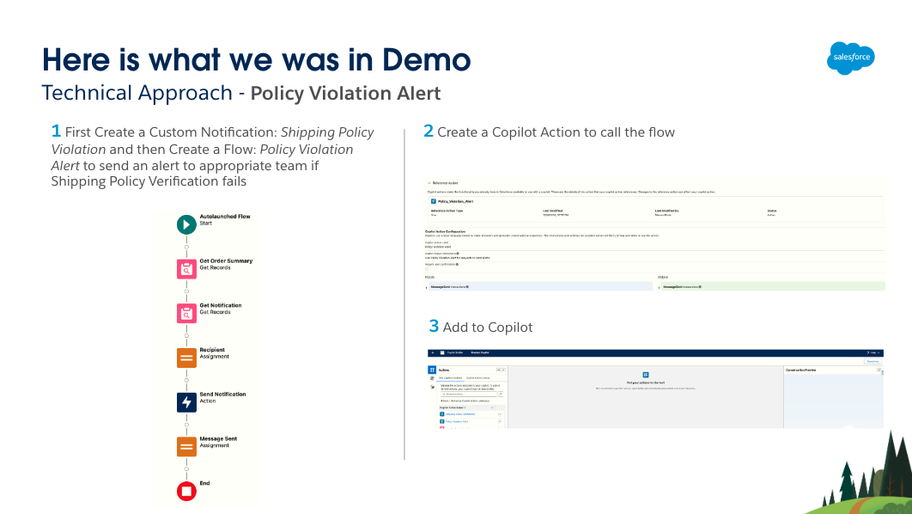

# Table of Contents

- [Embedded AI Use Case](#embedded-ai-use-case)
- [Solution Overview](#solution-overview)
- [Installation Prerequisites ](#prerequisites)
- [Installation Instructions](#installation-instructions)
- [Usage Instructions](#usage-instructions)
- [Additional Resources](#additional-resources)

## Embedded AI Use Case

## Solution Overview

### Solution Technical Approach

   -  
   -  
   -  

## Installation Prerequisites

1. Visit [Partner Community for AI & Einstein Partners](https://partners.salesforce.com/_ui/core/chatter/groups/GroupProfilePage?g=0F94V000000g5m5&fromEmail=1) to obtain the AI|SDO Pocket Guide from information section on left
    - Get a [Demo Org (SDO) for Partners](https://salesforce.quip.com/4m1gAiNB4O5I#temp:C:abXe66becdc9c4e44baa4491c352)
        - 

2. Enable [Prompt Builder](https://salesforce.quip.com/4m1gAiNB4O5I#temp:C:abX97591d0fb3b148398bb4dd599) and [Einstein Copilot](https://salesforce.quip.com/4m1gAiNB4O5I#temp:C:abX02f483812795425d8563c8d24)

3. Get ready with [Salesforce DX](https://trailhead.salesforce.com/content/learn/projects/quick-start-salesforce-dx)
    - Install [Salesforce CLI](https://developer.salesforce.com/docs/atlas.en-us.sfdx_setup.meta/sfdx_setup/sfdx_setup_install_cli.htm)
    - Install [Visual Studio Code](https://code.visualstudio.com/download)
    - Install [Git](https://git-scm.com/downloads)
    - Install [Salesforce Extension for Visual Studio Code](https://developer.salesforce.com/docs/platform/sfvscode-extensions/guide)

## Installation Instructions

1. Clone the repo `git clone git@github.com:mbsf2022/EmbeddedAI.git`
2. In Visual Studio Code, OPEN the folder EmbeddedAI
3. In Visual Studio Code, AUTHENTICATE to SDO Org
    - Open Command Palette or press Ctrl + Shift + P, then Select “SFDX: Authorize an Org“ and finally select Project Default and Allow Access
    - Alternatively, [Authorize SDO Org Using a Browser](https://developer.salesforce.com/docs/atlas.en-us.sfdx_dev.meta/sfdx_dev/sfdx_dev_auth_web_flow.htm)
4. In Visual Studio Code, right click the `force-app` folder and click "SFDX: Deploy This Source to Org"

    > Note: If genAiFunctions deploy errors then use [this](https://login.salesforce.com/packaging/installPackage.apexp?p0=04tao000000myt7) 1GP package. Make sure to remove two flows (Shipping Policy Verification and Policy Violation Alert) from SDO Org in case you deployed them in this step since they are already in the 1GP package

5. For the Order Summary object, make the Custom with Order Quick Summary as the default Compact Layout
    - Setup -> Object Manager -> Order Summary object -> Compact Layouts -> Compact Layout Assignment -> Edit -> Select Custom with Order Quick Summary
6. On Order Summary Record page, add Action - Order Quick Summary
    - App Launcher -> Order Management -> Order Summaries -> Select an Order -> Setup - Edit Page -> Select Highlight Panel on top -> Add Action - Order Quick Summary (Note: Upgrade to Dynamic Actions if not already selecting to Migrate and for SDO OMS Order Summary)
        - From:
            - 
        - To:
            - 

7. Assign Copilot Actions to Copilot and Activate Copilot
    - Setup -> Einstein Copilots -> Select Einstein Copilot -> Open in Builder -> Deactivate Copilot -> In Copilot Action Library and Select and Assign to Copilot

## Usage instructions

- [Don't forget to watch the demo](https://salesforce.vidyard.com/watch/h9n8v29iAvH6mXp1C85RK4?)

## Additional Resources

- [Einstein Copilot Documentation](https://help.salesforce.com/s/articleView?id=sf.copilot_intro.htm&type=5)
- [Einstein Copilot Actions Documentation](https://help.salesforce.com/s/articleView?id=sf.copilot_actions.htm&type=5)
- [Prompt Builder](https://www.salesforce.com/artificial-intelligence/prompt-builder/)
- [Prompt Builder Documentation](https://help.salesforce.com/s/articleView?id=sf.prompt_builder_about.htm&type=5)
- [Field Generation Prompt Templates in Action](https://help.salesforce.com/s/articleView?id=sf.prompt_builder_templates_in_action_field_gen.htm&type=5)
- [Einstein AI Confluence of ISV Platform Experts](https://confluence.internal.salesforce.com/pages/viewpage.action?pageId=661204803)
